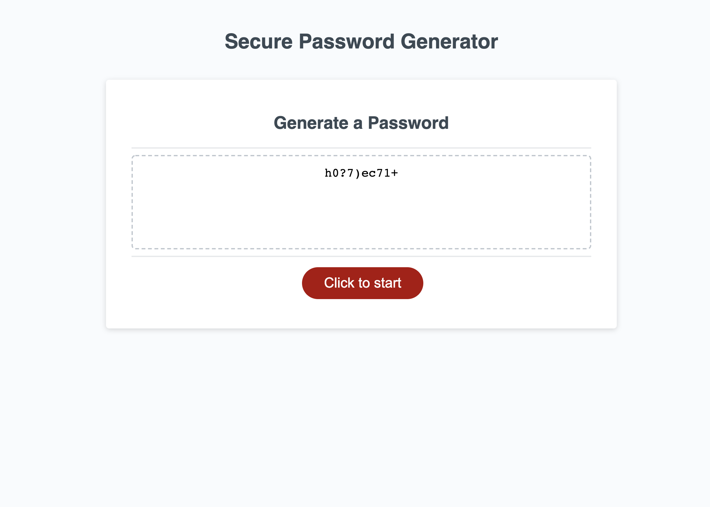

# secure-password-generator

## Description
This application, Password Generator, was created with the purpose of generating a secure password for the user based on their preferences for types of characters and length. This project was built using JavaScript functions with the intention of creating randomized strings that can be used as secure passwords. 

This project took an inordinate amount of time to develop, and I learned a lot about functions and how they can also be nested within one another, and how each one impacts another. 

## Installation
For installation and deployment, please [click here](https://candiceywu.github.io/secure-password-generator/). The application should launch with all windows prompts active. 

## Usage
When loaded for the first time, the application will not show any prompts. The application includes a red button named "Generate Password", that, when clicked, will prompt the user to enter a number between 8 and 128, which determines the password length. After this is correctly selected, the window will prompt the user to answer four questions on what types of characters they'd like to include in the password. The final auto-generated password will then show up in the white box for use. The following images show the web application's appearance, with prompts asking the user for their password preferences, followed by the final generated password:

## License & Copyright

(c) Candice Wu 

Licensed under the MIT License.
